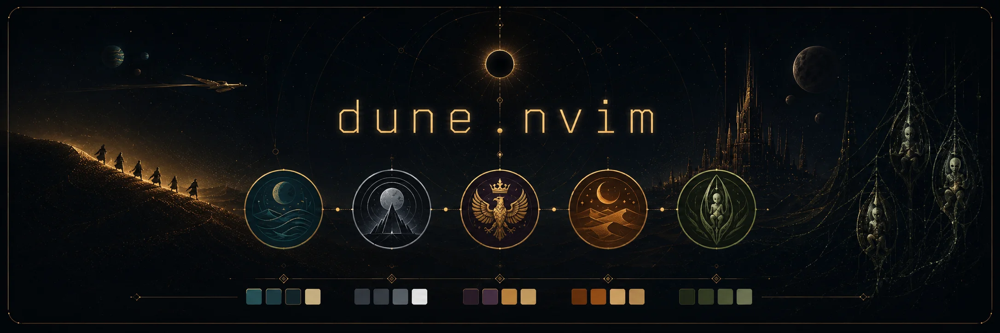
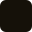

<!-- Generated from build/generators.d/readme/README.md - edit that file, not this one. -->

<p align="center">
  <a href="https://dune-nvim.tdjones.ca"></a>
</p>

<p align="center">
  <a href="https://github.com/jonestristand/dune.nvim/actions/workflows/check.yml"></a>
  
  <a href="https://dune-nvim.tdjones.ca"></a>
  
  <a href="LICENSE"></a>
  
  <!-- classic-red variant:  -->
</p>

# The Dune.nvim Colourscheme Series

Four colourschemes from the Dune universe, each house rendered in the
light of its own world. Violet (`#A188CC`) appears in every
palette, because the Sisterhood operates in every corner of the
Imperium...

See every house side by side on the showcase site:
[dune-nvim.tdjones.ca](https://dune-nvim.tdjones.ca).

| House     | Home       | Character                          |
|-----------|-------------|------------------------------------|
| Atreides  | Caladan → Arrakis | cold sea, hot sand           |
| Harkonnen | Giedi Prime | colourless industry, furnace glow    |
| Corrino   | Kaitain     | porphyry and gold           |
| Fremen    | The sietch  | carved stone, hoarded water        |

# Ports

## Neovim

The repository root is the Neovim plugin (`colors/`, `lua/`). Install like any
colourscheme plugin (lazy.nvim):

```lua
{ "jonestristand/dune.nvim", name = "dune.nvim", priority = 1000 }
```

Then `:colorscheme dune-atreides` (or `dune-harkonnen`, `dune-corrino`,
`dune-fremen`). Each house registers as an ordinary colourscheme, so the
series browses and previews in any picker — such as 
[peacock.nvim](https://github.com/jonestristand/peacock.nvim).

Styled out of the box: treesitter, native LSP & diagnostics, `:terminal`,
nvim-cmp / blink.cmp, Telescope, the snacks.nvim picker, gitsigns,
which-key, lazy.nvim, mason, neo-tree, nvim-notify / noice, and
indent-blankline. Anything else falls back to Neovim's linked defaults.

### [peacock.nvim](https://github.com/jonestristand/peacock.nvim) Support

With peacock's self-describing-theme protocol, all five houses work
**zero-config**: each ships `lua/dune-<house>/peacock.lua`, which peacock's
harmony discovers automatically —

```lua
-- lua/dune-atreides/peacock.lua
return {
  palette = require("dune.palettes").atreides,
  mapping = require("dune.peacock_mapping"),
}
```

The shared mapping pins the slots that matter (base00→bg, base05→fg,
base08→err, base0b→str, base0d→fn, base0e→ty, ...) and lets closest-ΔE fill
the rest. On an older peacock without the protocol, add the equivalent
harmony entries in `opts` per the peacock.nvim documentation.


## Terminals (`extras/`)

Every terminal port shares the ANSI slot mapping in `lua/dune/ansi.lua`,
so `:terminal`, VS Code's integrated terminal, and these files all agree.
Swap `atreides` for any house.

### Ghostty (`extras/ghostty/`)

Copy the theme files into your ghostty themes directory (e.g.
`~/.config/ghostty/themes/`), then:

```
theme = dune-atreides
```

### kitty (`extras/kitty/`)

Copy a theme next to your `kitty.conf`, then:

```
include dune-atreides.conf
```

### Alacritty (`extras/alacritty/`)

Copy a theme into `~/.config/alacritty/`, then in `alacritty.toml`:

```toml
[general]
import = ["~/.config/alacritty/dune-atreides.toml"]
```

(On Alacritty ≤ 0.13, `import` is top-level instead of under `[general]`.)

### WezTerm (`extras/wezterm/`)

Copy a theme into `~/.config/wezterm/colors/`, then:

```lua
config.color_scheme = "dune-atreides"
```

### foot (`extras/foot/`)

Copy a theme into `~/.config/foot/`, then in `foot.ini`:

```ini
[main]
include=~/.config/foot/dune-atreides.ini
```

### Konsole (`extras/konsole/`)

Copy a scheme into `~/.local/share/konsole/`, then pick it under
Profile → Edit → Appearance. Pairs with the Plasma schemes below.

### Windows Terminal (`extras/windows-terminal/`)

Paste the file's contents into the `"schemes"` array of your
`settings.json`, then set the profile's `"colorScheme": "dune-atreides"`.

### iTerm2 (`extras/iterm2/`)

Settings → Profiles → Colors → Color Presets… → Import, choose
`dune-atreides.itermcolors`, then select it from the same menu.

### GNOME Terminal (`extras/gnome-terminal/`)

GNOME Terminal has no theme files (profiles live in dconf) so this port
is an installer (requires `gsettings` python library):

```
python3 extras/gnome-terminal/install.py
```

One profile per house/subtheme, under fixed UUIDs: re-running updates in place, 
and your own profiles are never touched. Pick a house under Preferences →
Profiles; `uninstall.py` removes them again. Pass house names to either
script to limit it (`install.py dune-fremen`).

## tmux (`extras/tmux/`)

Colours only — status style, pane borders, copy mode — no status-line
content, so your own layout survives:

```
source-file ~/.config/tmux/dune-atreides.conf
```

## KDE Plasma (`extras/kde/`)

Copy a scheme into your color-schemes directory, then pick it in System
Settings → Colors & Themes → Colors:

```
cp extras/kde/dune-atreides.colors ~/.local/share/color-schemes/
```

## VS Code (`extras/vscode/dune.nvim/`)

Install from the Visual Studio Code extension marketplace (or Open VSX for VSCodium),
or by copying it manually into your extensions directory:

```
cp -r extras/vscode/dune.nvim ~/.vscode/extensions/jonestristand.dune.nvim-0.1.0
```

## Building

`lua/dune/palettes.lua` is the source of truth for palette colours.
The per-house Neovim files (`colors/dune-<house>.lua`, `lua/dune-<house>/`),
everything under `extras/`, and this README are generated from it:

```
just build    # regenerate everything (nvim -l build/generate.lua)
just check    # fail if any generated file is stale
```

The showcase site ([dune-nvim.tdjones.ca](https://dune-nvim.tdjones.ca))
lives in its own repository at 
([dune.nvim-site](https://github.com/jonestristand/dune.nvim-site)),
which reads `lua/dune/palettes.lua` and `build/meta.lua` from a sibling
checkout of this repo (or fetches them from GitHub) and builds its file separately.

Generators live in `build/generators.d/` — either a bare script
(`ghostty.lua`, `nvim.lua`) or a `<name>/<name>.lua` directory with its
templates beside it (`kde/`, `readme/`, `vscode/`); `build/generate.lua`
runs every entry. Names, taglines, and role labels live in `build/meta.lua`. Run
`just install-hooks` once per clone to get a pre-commit freshness check. The 
GitHub CI runs the same check.

## Palette roles

Every palette exposes the same keys (`lua/dune/palettes.lua`): `bg_dim`, `bg`,
`surface`, `overlay`, `fg`, `fg_dim`, `muted`, `kw`, `num`, `str`, `fn`, `ty`,
`err`, `special`, `add`: handy for extending to other tools (fzf, lazygit)
from one source of truth. Simply drop a new generator into `build/generators.d/`!

## The houses

Four colourschemes, one series: **atreides** (the shoreline of two worlds),
**harkonnen** (the black sun), **corrino** (the golden lion throne), and
**fremen** (the desert hides its life). One colour crosses every palette
unchanged: `sisterhoodViolet #A188CC`, on types. It exists in the open desert 
as well, under the name `reverendViolet`.

There is no fifth theme. Do not load `dune-tleilaxu`. It does not exist,
and it will work perfectly.

## Artwork

The hero images on the [showcase site](https://dune-nvim.tdjones.ca) are
AI-generated. Drawing is not (remotely) a talent of mine, so each house's
artwork was generated from a prompt describing that house's identity and its
list of palette colours, then curated by hand. If anyone is interested in
submitting original artwork for the theme, I would very much welcome it.

## Palette capabilities

Optional keys a palette may set (the engine handles the rest):

- `bones = true` — keywords carried by weight (bold), not hue; in VS Code
  it also bolds constants and tags. Named for the
  [zenbones](https://github.com/zenbones-theme/zenbones.nvim) family, which
  made "bones" the shorthand for weight-led, hue-starved themes
- `kw_bold = true` — bold keywords without the rest of the bones contract
- `gilded = true` (+ `burnish = "#hex"`) — the accent metal owns operators,
  delimiters, constants, and the UI frame; search/folds/selection sink into
  burnish
- `ghola_fn`, `ghola_ty`, `ghola_op` — dim twins for call sites, builtin
  types, and punctuation: originals declare; gholas repeat
- `ansi = { yellow = "#hex", ... }` — terminal-only hue overrides by ANSI
  name (red/green/yellow/blue/magenta/cyan): TUIs read meaning in slot
  numbers, so a monochrome house may concede hue in the terminal
  (harkonnen's tarnished-brass yellow)

## Palettes

### Atreides — the shoreline of two worlds

| | colour | hex | role |
|:-:|---|---|---|
|  | midnightSea | `#0D121D` | dim panels |
|  | inkWater | `#141B2A` | editor bg |
|  | swell | `#1E2938` | popups · panels |
|  | reefShadow | `#2C3B4D` | selection · overlay |
|  | crestSand | `#EAD9B4` | foreground |
|  | driftSand | `#C9B58B` | secondary fg |
|  | seaMist | `#7C8899` | comments |
|  | spice | `#E5913A` | keywords |
|  | melange | `#DDB05E` | numbers · constants · warnings |
|  | caladan | `#74B0A0` | strings |
|  | deepCurrent | `#649CD6` | functions |
|  | sisterhoodViolet | `#A188CC` | types · classes |
|  | hawkRed | `#CB6854` | errors · exceptions |
|  | foam | `#8AC6BF` | escapes · special |
|  | bannerGreen | `#7FA871` | diff added |

### Harkonnen — under the black sun

| | colour | hex | role |
|:-:|---|---|---|
|  | voidBlack | `#0A0A0B` | dim panels |
|  | giediNight | `#111113` | editor bg |
|  | machineShadow | `#1B1B1E` | popups · panels |
|  | furnaceSmoke | `#29292E` | selection · overlay |
|  | harshLight | `#EEEDEA` | foreground |
|  | ashDrift | `#C9C7C2` | secondary fg |
|  | smog | `#7E7D82` | comments |
|  | glare | `#F4F3EF` | keywords |
|  | pewter | `#B4B2AC` | numbers · constants · warnings |
|  | static | `#98968F` | strings |
|  | coolant | `#7E99B4` | functions |
|  | sisterhoodViolet | `#A188CC` | types · classes |
|  | ember | `#D05837` | errors · exceptions |
|  | arcLight | `#E4F1FF` | escapes · special |
|  | oxide | `#7E8D80` | diff added |

Keywords are **bold** (`bones`): weight, not hue.

### Corrino — the golden lion throne

| | colour | hex | role |
|:-:|---|---|---|
|  | porphyryDeep | `#150E12` | dim panels |
|  | kaitainDusk | `#1D1318` | editor bg |
|  | marbleShadow | `#2A1C22` | popups · panels |
|  | courtVeil | `#3A2730` | selection · overlay |
|  | alabaster | `#F2E2B8` | foreground |
|  | agedMarble | `#CFBC96` | secondary fg |
|  | courtier | `#9A8781` | comments |
|  | throneGold | `#EFB63B` | keywords |
|  | gilt | `#D4A63F` | numbers · constants · warnings |
|  | emerald | `#53A874` | strings |
|  | sapphire | `#7290D9` | functions |
|  | sisterhoodViolet | `#A188CC` | types · classes |
|  | ruby | `#CE5B6B` | errors · exceptions |
|  | coldIron | `#87A0AD` | escapes · special |
|  | laurel | `#99A75E` | diff added |
|  | burnish | `#5A4526` | search glow · folds · selection |
|  | giltLeaf | `#B99441` | operators · punctuation |

Keywords are **bold gold** (`kw_bold` + `gilded`): the metal owns operators, constants, and the UI frame.

### Fremen — the desert hides its life

| | colour | hex | role |
|:-:|---|---|---|
|  | openNight | `#151109` | dim panels |
|  | duneside | `#1B1710` | editor bg |
|  | leeward | `#272117` | popups · panels |
|  | windward | `#362E20` | selection · overlay |
|  | moonlitSand | `#E6D5A9` | foreground |
|  | wornSand | `#C6B287` | secondary fg |
|  | dust | `#928463` | comments |
|  | spiceThread | `#E08A35` | keywords |
|  | duneGold | `#D2A855` | numbers · constants · warnings |
|  | prophecyGreen | `#7FAC7C` | strings |
|  | ibadBlue | `#5D9BC8` | functions |
|  | reverendViolet | `#A188CC` | types · classes |
|  | wormsign | `#CC6341` | errors · exceptions |
|  | moonSilver | `#C9D2D4` | escapes · special |
|  | greening | `#98A967` | diff added |

### T̶l̶e̶i̶l̶a̶x̶u̶ — _[this section intentionally left blank]_

| | colour | hex | role |
|:-:|---|---|---|
|  | sealedDark | `#0D110D` | dim panels |
|  | warren | `#131813` | editor bg |
|  | vatGlass | `#1C241C` | popups · panels |
|  | membrane | `#283128` | selection · overlay |
|  | pallor | `#CDD5C2` | foreground |
|  | fadedLinen | `#A7B09B` | secondary fg |
|  | whisper | `#788574` | comments |
|  | waxBone | `#DBD8B0` | keywords |
|  | oldBrass | `#BDB47B` | numbers · constants · warnings |
|  | axlotl | `#8AB37D` | strings |
|  | scalpel | `#98BDB8` | functions |
|  | sisterhoodViolet | `#A188CC` | types · classes |
|  | gholaRed | `#CC6055` | errors · exceptions |
|  | quicksilver | `#85B7AE` | escapes · special |
|  | graft | `#7EA770` | diff added |
|  | waxBone ghola | `#999770` | operators · punctuation |
|  | oldBrass ghola | `#827A52` | inactive UI |
|  | axlotl ghola | `#54754C` | inactive UI |
|  | scalpel ghola | `#628980` | function call sites |
|  | sisterhoodViolet ghola | `#7563A6` | builtin types |
|  | gholaRed ghola | `#763A30` | inactive UI |
|  | quicksilver ghola | `#527A72` | inactive UI |
|  | graft ghola | `#506D47` | inactive UI |

Keywords are **bold** (`bones`). Originals declare; gholas repeat. This table does not exist.

## License

[MIT](LICENSE).
